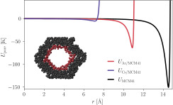
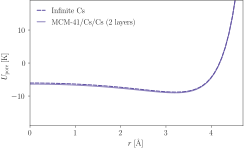
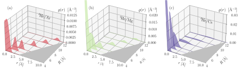
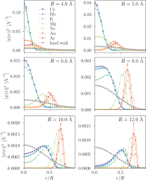
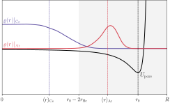
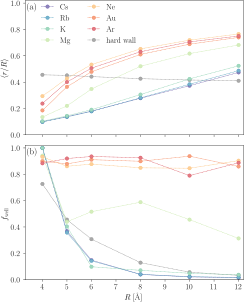
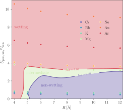
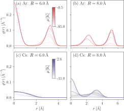
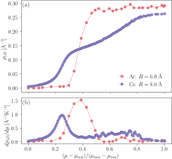
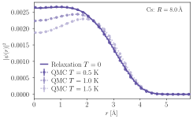

# Localization and Wetting of 4He Inside Pre-plated Nanopores

Sutirtha Paul, Taras Lakoba, Paul E. Sokol and Adrian Del Maestro

[arXiv:XXXX.YYYYY](https://arxiv.org/abs/XXXX.YYYYY)

### Abstract
Low dimensional quantum fluids, where one can probe the effects of enhanced thermal and quan-
tum fluctuations on macroscopic quantum wavefunctions, can be experimentally realized through
transverse physical confinement of superfluid helium on scales smaller than the coherence length.
Reaching this scale is difficult, requiring confinement in single or multiple pores with nanometer
radii. Porous silicates such as MCM-41 have a pore radius larger than the coherence length of 4He,
and in this work we systematically explore the possibility of pre-plating pores with different elements
to reduce the pore size without localizing the confined superfluid. Through a direct solution of the
few-body Schrodinger equation combined with quantum Monte Carlo simulations, we explore the
behavior of helium confined inside cylindrical nanopores for a range of pre-plating elements, includ-
ing rare gases and alkali metal. For rare gases, we find that helium remains strongly attracted to the
pore walls and any atoms in the core form an incompressible liquid. For alkali metals such as Cs,
weak interactions between helium and the pre-plating material prevent localization near the walls
and enable delocalization in the pore center. Our results extend previous results for helium wetting
on flat two dimensional coated substrates to the curved geometry inside nanopores, and demonstrate
that alkali pre-plated nanopores may enable a tunable one-dimensional confined quantum liquid of
helium.

### Description
This repository includes links, code, scripts, and data to generate the figures in a paper.

### Requirements
The data in this project was generated via two methods: Relaxation Method and Path Integral Monte Carlo. Processed data is included in the [data](https://github.com/DelMaestroGroup/papers-code-NanoporesWetting/tree/main/data) directory and the full raw simulation data set is available online at 

1. The two body data was generated using a accelerated relaxation method code given [here](https://github.com/paulsphys/relaxation/tree/main)
2. All many body data was generated with quantum Monte Carlo using our [open source path integral software](https://code.delmaestro.org) also available on [github](https://github.com/delmaestrogroup/pimc).

1. A minimal environment to execute these notebooks can be installed via `pip install -r requirements.txt`
2. [Dependency Name](https://dependencelink)
3. ...

### Support
This work was performed with support from the U.S. Department of Energy, Office of Science, Office of Basic Energy Sciences, under Award Number DE-SC0024333.

<!--

-->

### Figures

#### Figure 01: Potential comparisons

#### Figure 02: Potential accuracy

#### Figure 03: Waterfall Plots

#### Figure 04: Radial densities for N=2

#### Figure 05: Wetting parameter illustration

#### Figure 06: Wetting parameter evolution

#### Figure 07: Phase diagram

#### Figure 08: Many Body densities

#### Figure 09: Linear density and compressibility

#### Figure 10: Relaxation and PIMC convergence

This figure is relesed under [CC BY-SA 4.0](https://creativecommons.org/licenses/by-sa/4.0/) and can be freely copied, redistributed and remixed.

